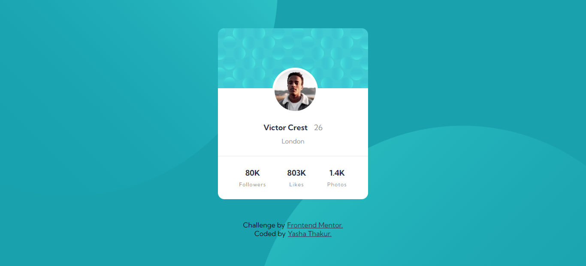

# Frontend Mentor - Profile card component solution

This is a solution to the [Profile card component challenge on Frontend Mentor](https://www.frontendmentor.io/challenges/profile-card-component-cfArpWshJ). Frontend Mentor challenges help you improve your coding skills by building realistic projects.

## Overview

### The challenge

- Build out the project to the designs provided

### Screenshot

### Links

- Solution URL: [Add solution URL here](https://www.frontendmentor.io/challenges/profile-card-component-cfArpWshJ/hub/profile-card-component-aVMfnKNcQ)
- Live Site URL: [Add live site URL here](https://elegant-galileo-40834f.netlify.app/)

## My process

### Built with

- Semantic HTML5 markup
- CSS custom properties
- Flexbox

## Author

- Website - [Yasha-Thakur](https://github.com/Yasha-Thakur)
- Frontend Mentor - [@Yasha-Thakur](https://www.frontendmentor.io/profile/Yasha-Thakur)
